# Alaa ElGhoul

## AI Specialist & Automation Engineer | Software/Embedded Systems

---

## About

I'm an **AI Specialist and Automation Engineer** with 4+ years of experience in software and embedded systems. I build LLM-powered applications, n8n automation pipelines, and Claude/OpenAI API-integrated products. My work spans prompt engineering, AI-driven UI development in React, and end-to-end workflow automation with a consistent focus on output quality and clean architecture.

I enjoy building systems where **state, rules, and behavior are clearly defined** — whether that's an embedded access-control system, a game with deterministic logic, a full-stack application with structured data flow, or an AI assistant with voice interface.

I value **clean architecture, modular design, and scalability**. If it ships, it has to work well.

## What I Build

| Area | Focus |
| --- | --- |
| **AI & Automation** | LLM-powered apps, n8n pipelines, Claude/OpenAI API integration, conversational AI, voice interfaces |
| **Web Applications** | AI-driven UIs, dashboards, full-stack apps with structured data flow |
| **Systems & Embedded** | ESP32 firmware, authentication logic, state machines, hardware control |
| **Game Logic** | Deterministic state transitions, authoritative logic, memory match DApp |

## Stack

## Projects

| Project | Description |
| --- | --- |
| **[JARVIS AI Assistant](https://github.com/AE707)** | React + Claude API + Web Audio API + SpeechRecognition. Multi-turn conversational AI with voice input/output. |
| **[Fintech Automation Suite](https://github.com/AE707)** | n8n + Retool + Supabase PostgreSQL. Three production-grade automations: transaction approval (50€ threshold), queue buffer system, audit/approval logging pipeline. |
| **[AccessControlDoor](https://github.com/AE707/AccessControlDoor)** | Embedded ESP32 firmware demonstrating authentication logic, state machines, and hardware control. |
| **[Memory Match DApp](https://github.com/AE707/DApp)** | Full-stack game with deterministic state transitions and authoritative logic on blockchain. |

> I treat projects as **engineering systems**, not demos.

## Contact

I'm available for freelance projects, product engineering work, and technical conversations around AI automation, embedded systems, and full-stack development.

- **Email**: [AE7_07@outlook.com](mailto:AE7_07@outlook.com)
- **LinkedIn**: [linkedin.com/in/alaaelghoul](https://linkedin.com/in/alaaelghoul)
- **GitHub**: [github.com/AE707](https://github.com/AE707)

---

## 👀 Views & Followers

---

*Built with clean architecture, deterministic logic, and no broken noise.*